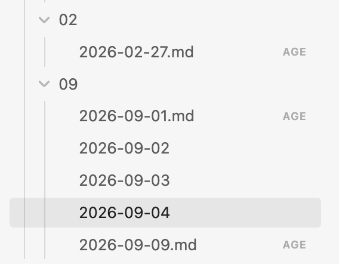
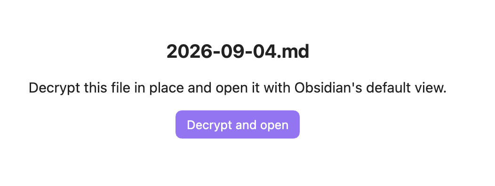
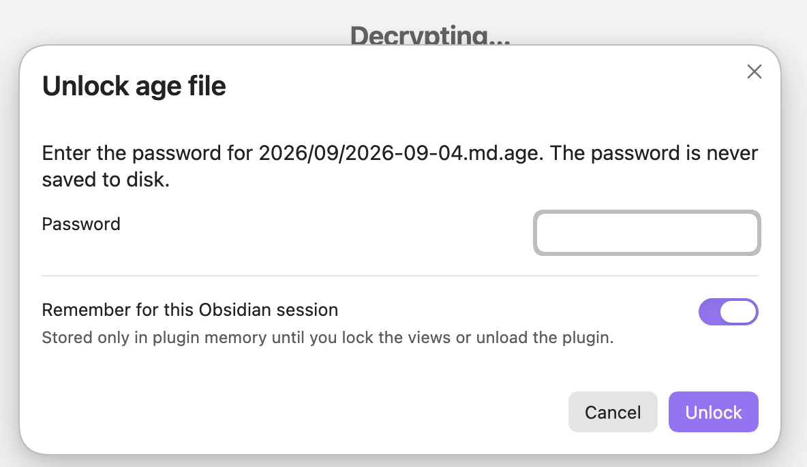
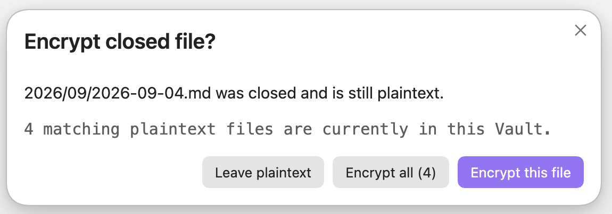
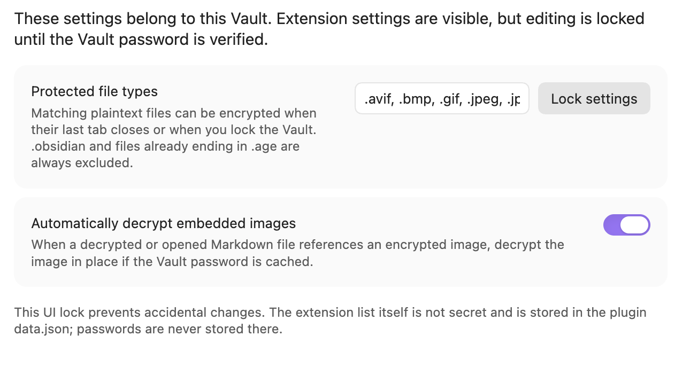
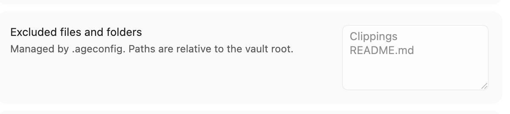
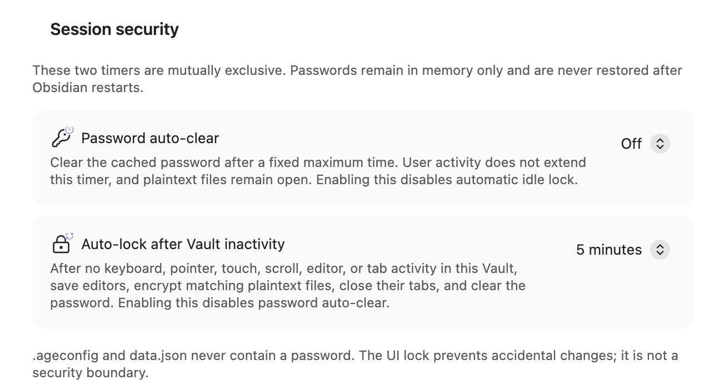
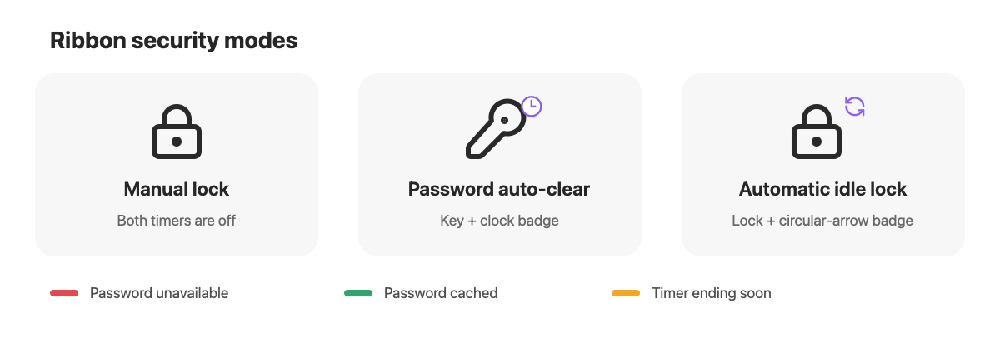

# Vault in Vault

把私密笔记和图片加密保存在 Obsidian Vault 中，只在需要时解锁。

Vault in Vault 可以帮你：

- **保护静态文件内容。** 加密日记、个人资料、工作笔记和图片，避免它们在 Vault 副本、备份或同步目录中保持可读。
- **保留原来的文件位置。** 锁定后的文件仍在原目录中，并保存为标准的密码加密 `.age` 文件。
- **解锁后正常使用 Obsidian。** 点击受保护文件并输入密码，即可继续使用原生编辑器、图片预览、链接和搜索。
- **不离开 Obsidian 就能重新锁定。** 最后一个 Tab 关闭时加密当前文件、随时锁定全部暴露的明文，或在 Vault 闲置一段时间后自动锁定。
- **决定哪些内容需要保护。** 通过 Vault 级 `.ageconfig` 设置文件扩展名，并排除公开目录、模板或单独文件。

Vault in Vault 保护文件内容，但不会隐藏文件名和目录结构。

> [!WARNING]
> 文件解锁期间，明文会真实写入磁盘。请先备份，并在用于重要数据前理解下面的安全边界。本项目尚未经过独立安全审计。

[English](../README.md)

插件界面会跟随 Obsidian 的语言设置。目前包含英文、简体中文、繁体中文、日文和韩文。

## 从 Obsidian 社区插件安装

1. 在 Obsidian 中打开 **Settings -> Community plugins**。
2. 点击 **Browse**，搜索 **Vault in Vault**。
3. 打开插件页面，依次点击 **Install** 和 **Enable**。

Vault in Vault 目前只支持桌面版。也可以先查看它的 [Obsidian Community 页面](https://community.obsidian.md/plugins/vault-in-vault)。

## 快速了解使用方式

### 加密文件仍留在原目录

加密文件会在文件列表中显示 **AGE** 标记。文件名和目录结构仍然可见，但没有密码无法读取内容。



### 点击加密文件即可打开

需要阅读或编辑时，点击 **解密并打开**。



输入密码后即可解密。可以选择只在当前 Obsidian 会话的内存中记住密码，密码不会写入磁盘。



解密完成后，笔记会进入 Obsidian 原生编辑器。文件解锁期间，Markdown、图片预览、链接、搜索和兼容的第三方插件都可以正常工作。

### 关闭 Tab 时决定是否重新加密

关闭最后一个仍打开的受保护明文 Tab 时，可以只加密刚关闭的文件、加密所有匹配的明文文件，或者暂时保留明文。只要还有其他受保护明文 Tab 开着，关闭其中一个不会打断编辑。



### 选择要保护的文件类型

设置页面会显示 Vault 批量锁定覆盖的文件扩展名。默认可以查看设置，但修改前必须验证密码，避免误操作。



### 排除不需要加密的文件和目录

如果公开目录、模板或某个文件永远不应参与加密和密码验证扫描，可以在 `.ageconfig` 的 `exclude` 中填写相对于 Vault 根目录的路径。填写一个目录会排除它的整个子目录。使用共享策略时，设置页会以只读方式显示当前排除项。



### 限制密码在内存中的可用时间

**会话安全**提供两个互斥选项。**自动清除密码**只在固定时间后清除缓存密码；**Vault 闲置后自动锁定**会等待 Vault 一段时间没有操作，保存打开的 Markdown 编辑器，加密匹配的明文，关闭已经成功保护的 Tab，最后清除密码。



Ribbon 图标分别表达配置模式和密码状态：



## 主要功能

- 从文件列表直接打开使用密码加密的 `.age` 文件。
- 原位解密 Markdown 和图片，保留原生编辑、预览、链接、搜索和第三方插件能力。
- 关闭最后一个受保护明文 Tab 后，可选择加密刚关闭的文件、加密全部匹配明文或暂时保留明文。
- 提供 **立即加密并锁定 Vault** 命令和 Ribbon 锁按钮。
- 用户明确选择后，密码仅缓存在当前插件会话的内存中。
- Ribbon 锁按钮下方用红、绿、黄状态灯表示密码不可用、已缓存或 timer 即将到期。
- 可以在固定时间后只清除缓存密码，也可以在当前 Vault 长时间没有操作后自动加密并锁定。
- 默认保护 `.md`、`.avif`、`.bmp`、`.gif`、`.jpeg`、`.jpg`、`.png`、`.svg` 和 `.webp`，也可以设置要跳过的文件或文件夹。
- 保留子目录，排除 Vault 配置目录和已经以 `.age` 结尾的文件。
- 删除源文件前，会重新读取并验证刚生成的明文或密文。

## 文件流程

打开 `notes/private.md.age` 并选择 **Decrypt and open**：

```text
notes/private.md.age
    -> 解密并验证 notes/private.md
    -> 删除 notes/private.md.age
    -> 使用原生编辑器打开 notes/private.md
```

关闭最后一个仍打开的受保护明文 Tab 时，弹窗会提供默认折叠的待加密文件清单；如果 `.ageconfig` 配置了排除路径，还会用另一个默认折叠的清单列出不会加密的文件和文件夹。随后可以选择：

- **Encrypt this file**：只加密刚关闭的文件；
- **Encrypt all (N)**：加密所有匹配的明文文件；
- **Leave plaintext**：本次保留明文。

Tab 会先关闭，让 Obsidian 完成正常保存，然后在应用仍运行时执行加密。取消密码输入、加密期间文件发生变化或验证失败时，插件都会保留明文源文件。

选择 **Encrypt all** 或运行 **Encrypt and lock vault now** 后，插件会主动清除当前 session 缓存的密码；这不是 Obsidian session 自然结束。之后再打开加密文件会重新询问密码。只加密刚关闭的单个文件时不会主动清除缓存。

插件不会依赖应用退出钩子进行交互式加密，因为 Obsidian 不会可靠地等待异步加密完成。退出前请先关闭受保护的 Tab，或运行 **Encrypt and lock vault now**。

## 密码规则

- Vault 中存在未被排除的 `.age` 文件时，会用其中体积最小的文件验证密码。
- 尚无 `.age` 文件时，首次加密要求输入两遍密码。
- 选择记住密码后，密码只存在于当前插件会话的 JavaScript 内存中。
- 密码不会写入 `data.json`。
- 不提供密码恢复；密码丢失后无法恢复密文。

### Session 安全 timer

设置页提供两个互斥的 timer，默认都为 **Off**：

- **Password auto-clear**：从密码进入内存时开始固定计时。用户操作不会延长时间；到期只清除密码，不关闭 Tab，也不改变仍为明文的文件。
- **Auto-lock after Vault inactivity**：当前 Vault 中发生键盘、鼠标、触摸、滚动、编辑或 Tab 切换时会重新计时。到期后，插件先等待 Markdown 编辑器保存，再加密所有匹配且未被排除的明文，关闭已经成功保护的 Tab，并清除密码，不再弹出确认框。

Ribbon 使用“钥匙 + 小钟”表示 password auto-clear，使用“锁 + 环形箭头”表示自动 idle 锁定；两个 timer 都关闭时显示普通锁。右上角 badge 只表示配置模式，底部红、绿、黄状态灯分别表示密码不可用、可用和 deadline 即将到期。设置页使用相同图标。

自动 idle 锁定必须把密码保留在内存中，因此启用后密码窗口会固定开启 **Remember until automatic lock**。Obsidian 重启后绝不会恢复密码；在用户再次输入密码前，自动锁定处于未 armed 状态。

这里的 idle 只表示插件没有在这个 Vault 的 Obsidian 主窗口或 popout 窗口中观察到操作，不是操作系统级 idle。切换到其他应用后会继续计时；后台同步和文件修改时间不会重置计时。电脑休眠或 Obsidian 被暂停时，恢复后会立即重新检查 deadline。

## 加密范围设置和 `.ageconfig`

文件类型选项位于 **Settings -> Vault in Vault -> Protected file types**，安全 timer 也位于同一个设置页面。没有 `.ageconfig` 时，扩展名、排除路径和 timer 设置保存在当前 Vault 插件目录的 `data.json` 中；密码永远不会写入其中。验证 Vault 密码后才能编辑保护策略，timer 则始终可以调整。

如果希望 Obsidian 插件和 Go 命令行工具共用同一套策略，可以在 Vault 根目录创建 `.ageconfig`：

```json
{
  "extensions": [".md", ".png", ".jpg"],
  "exclude": ["Public", "Templates/daily.md", "attachments/shared"]
}
```

- `extensions` 决定哪些明文类型需要保护；它可以省略，省略时使用内置的 Markdown 和常见图片默认类型。显式提供时不能是空数组。
- `exclude` 可以写相对于 Vault 根目录的单个文件或目录；目录下的全部内容都会跳过。
- 路径区分大小写，不支持 `*`、`?` 等通配符，也不能使用绝对路径或 `..`。
- `.ageconfig` 存在时优先于 `data.json`。设置页会显示策略来源，并把共享的扩展名和排除项显示为只读；可以用设置页按钮在系统默认编辑器中打开它，或在 Finder/文件管理器中显示。保存后点击 **重新加载 .ageconfig**。
- 配置无效时插件会阻止加密，不会悄悄退回到更宽泛的默认策略。`.ageconfig` 和 `data.json` 都不会保存密码。

如果只想配置排除路径，可以这样写：

```json
{
  "exclude": ["Public", "Templates"]
}
```

## 安全边界

- 解锁后的内容是磁盘上的普通明文文件。
- Metadata cache、搜索索引、File Recovery、第三方插件、同步工具和系统备份可能保留明文。
- 崩溃、强制结束、断电或直接退出应用可能留下明文。
- JavaScript 无法保证密码字符串立即从进程内存中清除。
- 插件只会在创建、读回并验证替代文件之后删除源文件。把源明文放入废纸篓会留下未加密副本，因此加密切换不会使用 Obsidian 的常规废纸篓行为。
- 文件解锁期间，插件无法防御能够读取 Obsidian 进程或本地文件的其他软件和用户。

插件没有遥测、广告、账号要求或远程服务，也不会访问当前 Vault 之外的文件。正常使用完全离线。

## 本地安装

安装本地开发版本需要 Node.js 20 或更新版本：

```bash
npm ci
npm run check
npm run install:vault -- "/你的/Vault/绝对路径"
```

最后一条命令会把 `main.js`、`manifest.json` 和 `styles.css` 复制到：

```text
<Vault>/.obsidian/plugins/vault-in-vault/
```

也可以手动复制这三个文件。随后重启或重新加载 Obsidian，并在 **Settings -> Community plugins** 中启用 **Vault in Vault**。

如果安装过 ID 为 `fileencrypt-age-viewer` 的早期开发版，请先停用旧版。新版 ID 是 `vault-in-vault`，Obsidian 会把它们识别为两个插件。若要保留扩展名配置，可以把旧目录的 `data.json` 复制到新目录；其中不包含密码。

## 开发和发布

```bash
npm ci
npm run dev
npm test
npm run check
```

使用 `npm version patch`、`npm version minor` 或 `npm version major` 更新版本。脚本会同步 `package.json`、`manifest.json` 和 `versions.json`。推送不带 `v` 前缀、与 manifest 版本完全一致的 tag 后，GitHub Actions 会构建并生成草稿 Release。这就是正常的 **Create a release** 步骤，不需要再手动创建第二个 Release。

打开草稿，填写 release notes，并确认 `main.js`、`manifest.json` 和 `styles.css` 是三个可以单独下载的附件，然后点击 **Publish release**。草稿状态无法被 Obsidian 安装，也不能用于 Community 提交。

## 兼容性

Vault in Vault 0.8.0 及后续版本需要 Obsidian 1.8.7 或更新版本，以便插件跟随 Obsidian 当前选择的界面语言。

## 许可证

[MIT](../LICENSE)。第三方依赖许可见 [THIRD_PARTY_NOTICES.md](../THIRD_PARTY_NOTICES.md)。
